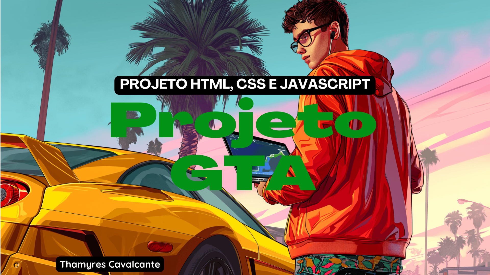

# Projeto GTA

## Descrição do projeto 

 Projeto desenvolvido junto com os Irmãos Dev, criação de um site do jogo GTA.

## ✔️ Técnicas e tecnologias utilizadas
- `HTML`: É a linguagem de marcação usada para estruturar e organizar o conteúdo de uma página web. Ela fornece a base para a criação de documentos web, definindo elementos como cabeçalhos, parágrafos, listas, links, imagens e outros componentes. HTML não lida com o estilo ou a interatividade da página, focando apenas na estrutura do conteúdo.
- `CSS`: É usado para estilizar e formatar a apresentação visual de elementos HTML. Ele permite controlar a aparência da página, definindo propriedades como cores, fontes, margens, posicionamento e layout. Com o CSS, é possível criar layouts responsivos e designs atraentes.
- `JavaScript`: É uma linguagem de programação que permite adicionar interatividade e dinamismo às páginas web. Com JavaScript, é possível manipular o conteúdo da página, responder a eventos do usuário, realizar chamadas a serviços web, e muito mais. Ele é essencial para o desenvolvimento de aplicativos web modernos e responsivos.

## 📁 Acesso ao projeto
É possível acessar o projeto através do [Link](https://github.com/Thamyresmya/Projeto_GTA).

Neste repositório você tem acesso a todo o material produzido no curso.

## 🛠️ Abrir e rodar o projeto
Para abrir e rodar o projeto, basta abrir o aquivo `index.html` no navegador.

## 📸 Gif
Cadastro de filmes
</img>

## Desenvolvedores

| [ Thamyres Cavalcante](https://github.com/Thamyresmya) |   |
| :---: | :---: 

## 👍 Me siga nas redes sociais

- [Linkedin](https://www.linkedin.com/in/thamyrescavalcante/)
- [Instagran](https://www.instagram.com/thamyres__cavalcante/)

 

---

### Feito com 💜 by Thamyres Cavalcante.

